# Solar Panel Analysis
 

## Background and Overview
As part of our ongoing efforts to optimize renewable energy output, our team conducted an in-depth analysis of solar panel generation and weather sensor data collected from two solar farms in India. Over a 34-day period, data was recorded at 15-minute intervals to capture detailed operational metrics.

### Data Collection & Structure:

#### Power Generation Data:
 Data is collected at the inverter level, where each inverter monitors multiple strings of solar panels. This granular approach allows us to assess the performance of individual inverters and identify any discrepancies or areas for maintenance.  

#### Weather Sensor Data:
Weather measurements are captured at the plant level via a single, strategically placed array of sensors. This setup provides an overview of environmental conditions impacting the entire solar farm, ensuring that our energy generation forecasts account for real-time weather variations.

By integrating these datasets, we can develop robust models to predict future power output, identify efficiency trends, and ultimately enhance our operational strategies.

## Executive Summary

## Project Goals
Analysis aims to achieve the following objectives:
1. Forecast Future Power Generation
    - Develop accurate predictive models to forecast solar power generation for the next few days.
    - This will support improved grid management and energy distribution planning.
2. Optimize Maintence Scheduling:
    - Detect performance patterns that indicate when panels may require cleaning or routine maintenance, ensuring that overall effiency is maintained and downtime is minimized.
3. Identifying Faulty or Underperforming Panels:
    - Analyze the data to pinpoint panels that are malfunctioning or underperforming, enabling targeted interventions to enhance system reliablity and energy output.

## Data Structure Overview
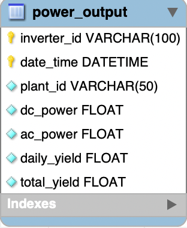
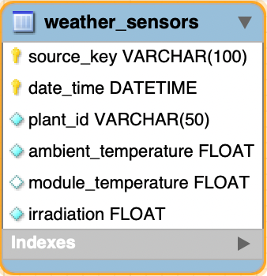

## Insights Deep Dive
### 2. Optimize Maintenance Scheduling
#### Plant 1
To optimize maintenance scheduling, we analyzed the correlation between weather variables and power generation. Initially, the heatmap revealed a weak correlation between daily yield and all other variables, suggesting potential issues with data collection.

Upon further investigation, we identified an anomaly in week 24, where daily yield surged unexpectedly. To prevent this outlier from skewing our analysis, we removed week 24 and re-evaluated the correlation. The revised heatmap showed a stronger relationship between daily yield and weather variables, particularly module temperature and ambient temperature.

After removal, the correlation between daily yield and module temperature increased from 0.27 to 0.71, indicating a significant improvement in data reliability. Given this anomaly, a detailed investigation into Plant 1’s inverters is necessary to determine its cause.

Additionally, module temperature can serve as a key indicator for determining cleaning schedules. Since it should closely align with ambient temperature, deviations may suggest dust accumulation or other factors affecting efficiency. Implementing this insight could improve long-term performance and maintenance planning.
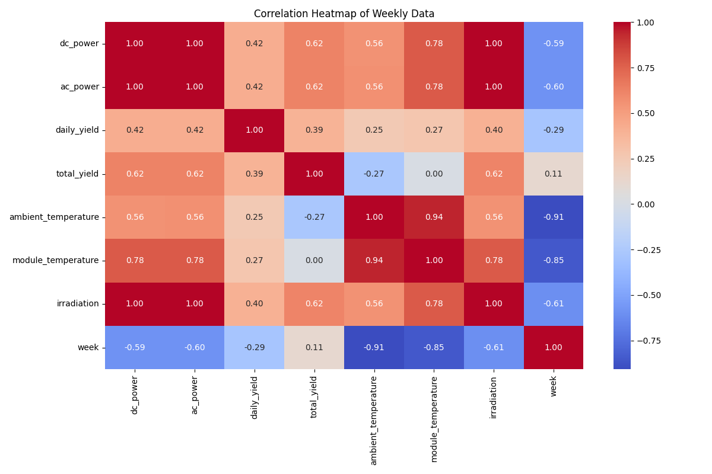
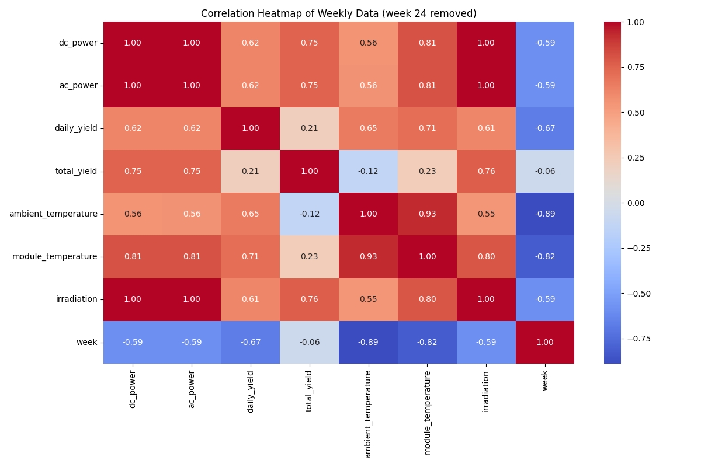
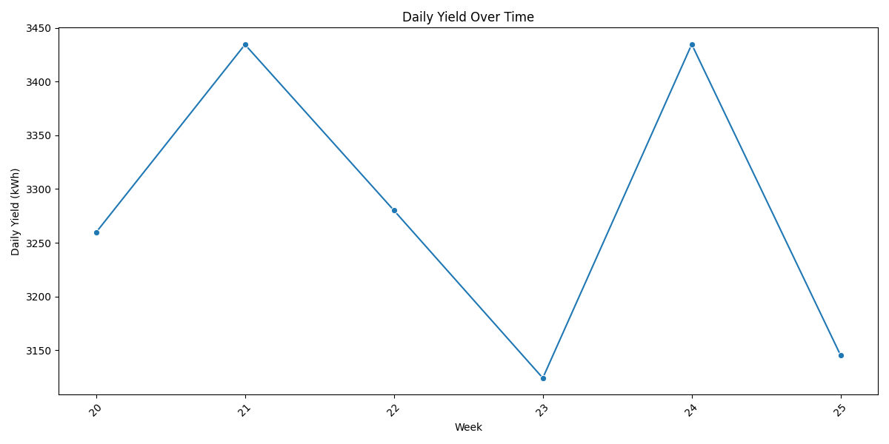
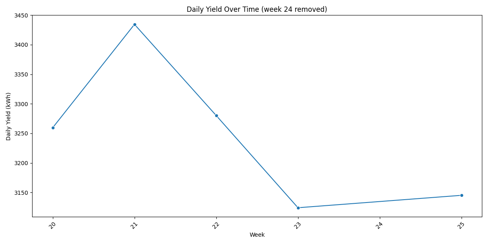
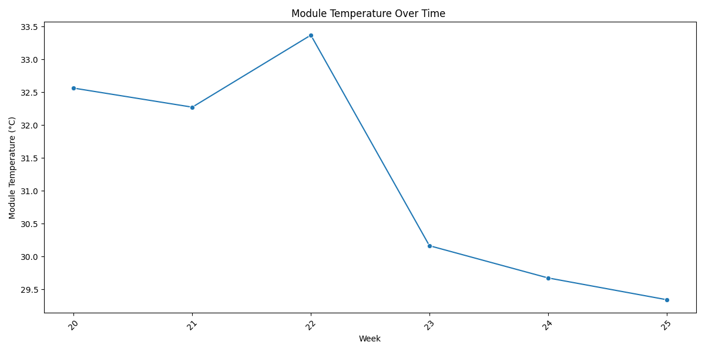
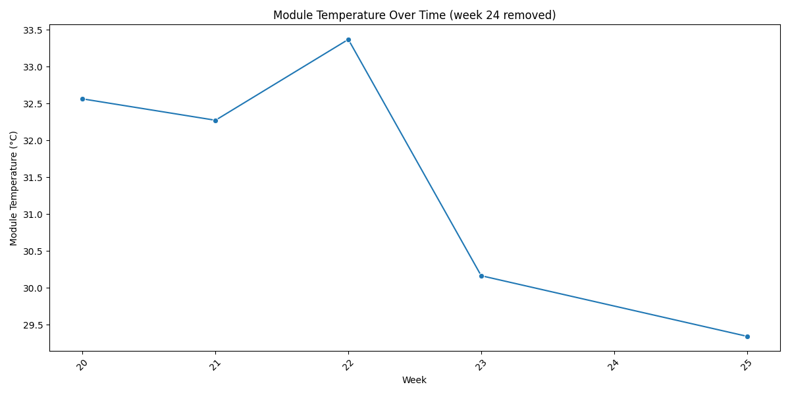

#### Plant 2
In Plant 2, the correlation between daily yield and weather variables was immediately stronger than in Plant 1. However, the strongest correlation was observed between daily yield was both DC power and AC power, with a correlation coefficient of 0.79. This suggests that the inverters are operating efficiently, with minimal energy loss during conversion.

Furthermore, DC and AC power can serve as key indicators for determining cleaning schedules. A significant drop in AC power relative to DC power may indicate dirty panels, as reduced efficiency in energy conversion often correlates with surface contamination. Monitoring these metrics can help optimize maintenance timing, ensuring sustained performance.
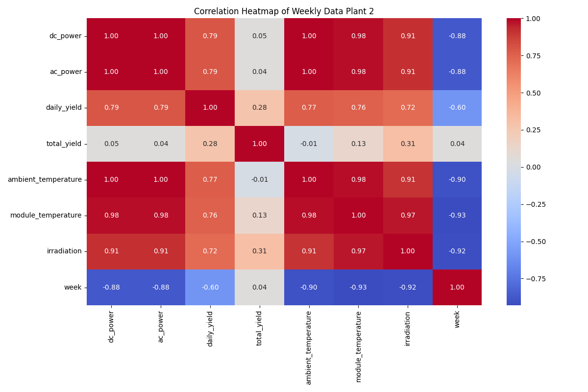
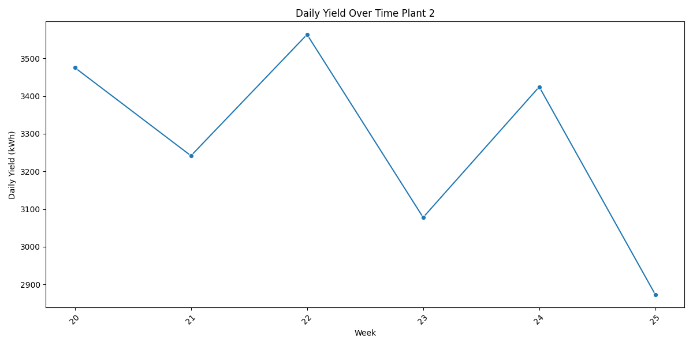
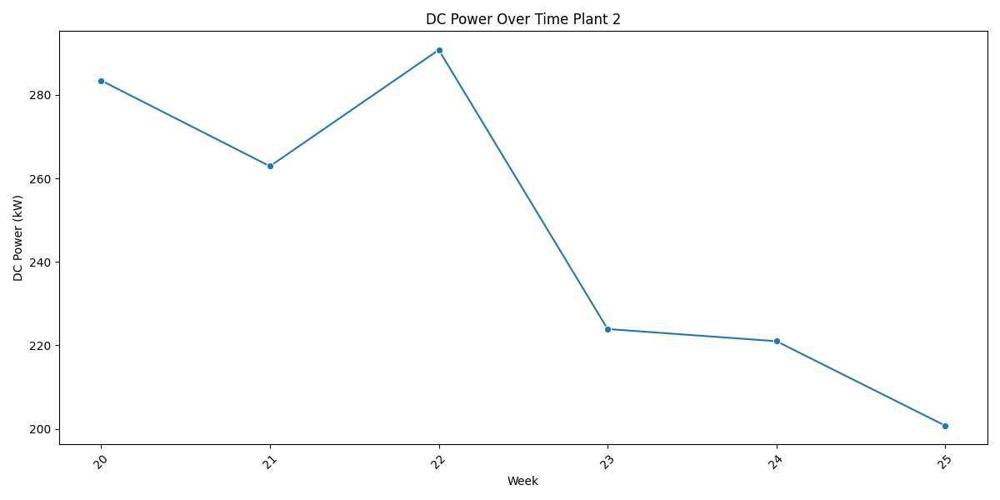

### 3. Indentifying Faulty or Underperforming Panels
 - Plant 1 consists of 22 inverters, with 3 underperforming relative to the standard deviation of the plant’s average daily yield. These inverters are generating approximately 3% less energy than expected, resulting in a daily yield reduction of 274.7 kWh. Over a month, this could lead to a total energy loss of ~8,241 kWh, significantly impacting overall plant efficiency and potential revenue.
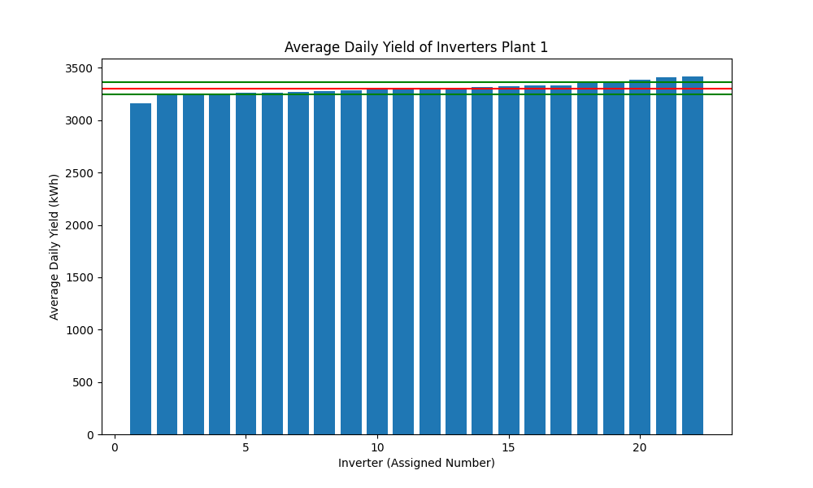
- In contrast, Plant 2 is experiencing a significantly more drastic performance issue. Four underperforming solar panels are generating 23% less energy than expected, leading to a daily yield reduction of 3,202.95 kWh—over 11 times the loss observed in Plant 1. If left unresolved, this could result in a staggering ~96,088.5 kWh loss per month, posing a substantial threat to operational efficiency and profitability
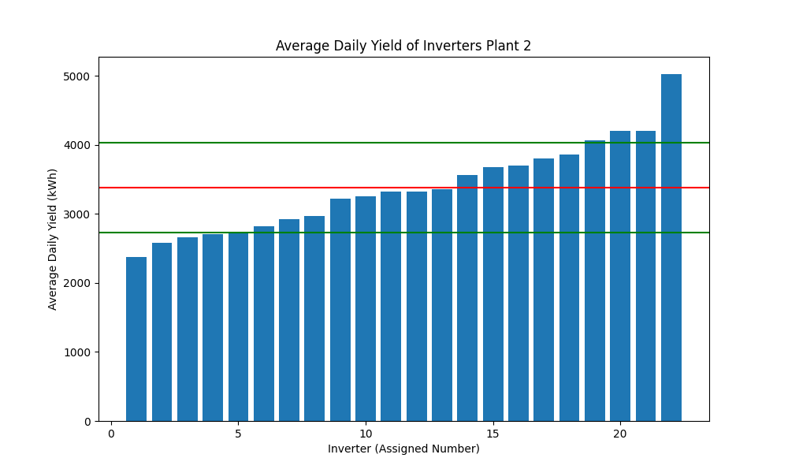

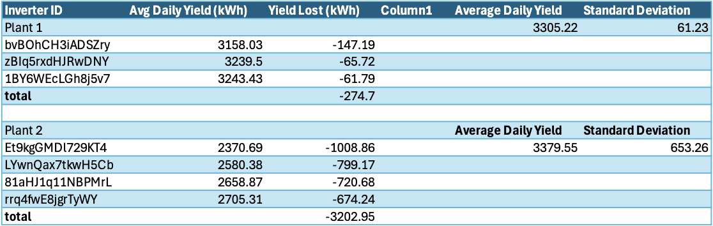
- Plant 1 has a moderate efficiency loss (3%, 274.7 kWh/day), requiring monitoring and maintenance checks.
- Plant 2 has a severe efficiency loss (23%, 3,202.95 kWh/day), demanding urgent investigation and   corrective actions.

## Recommendations

## Technical Details

## Caveats and Assumptions

