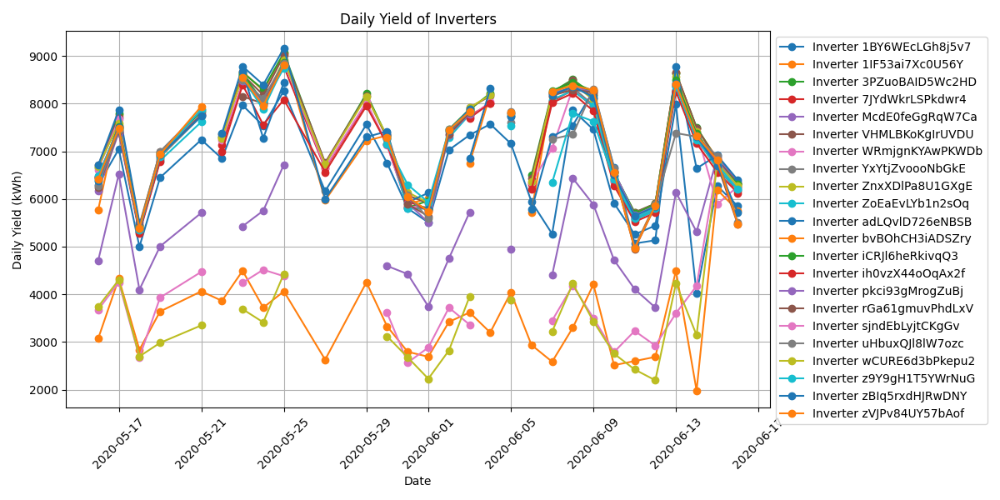
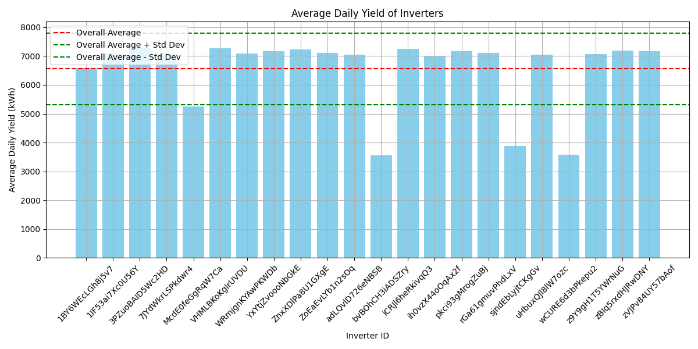
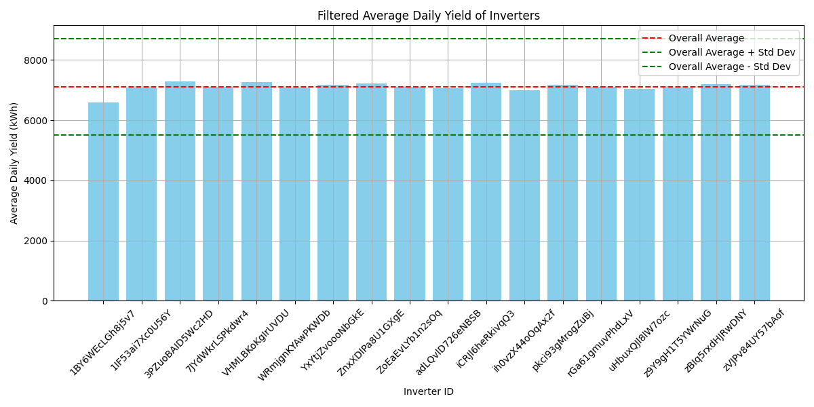
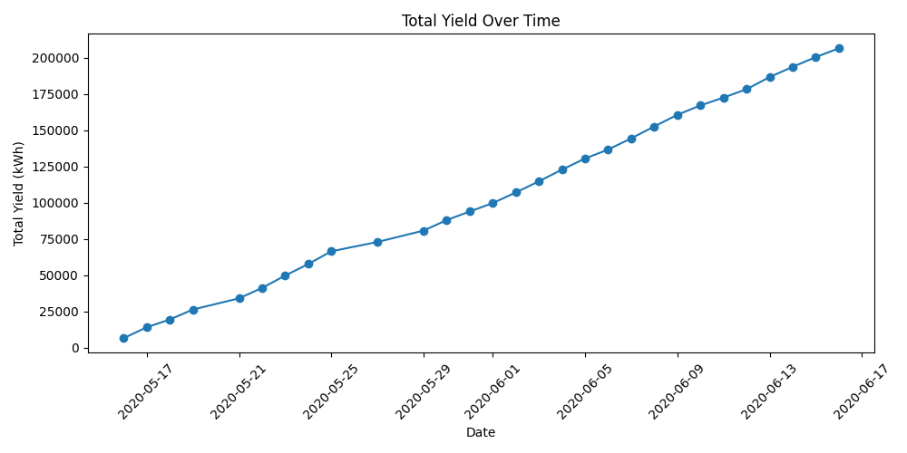
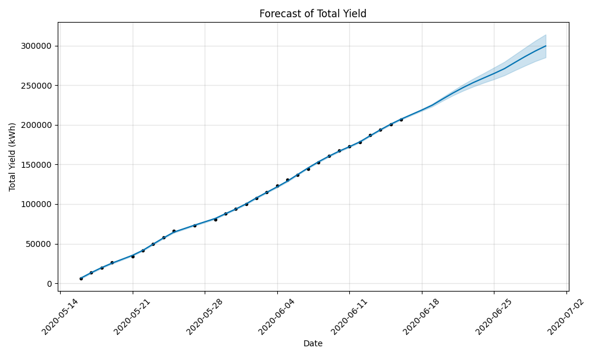
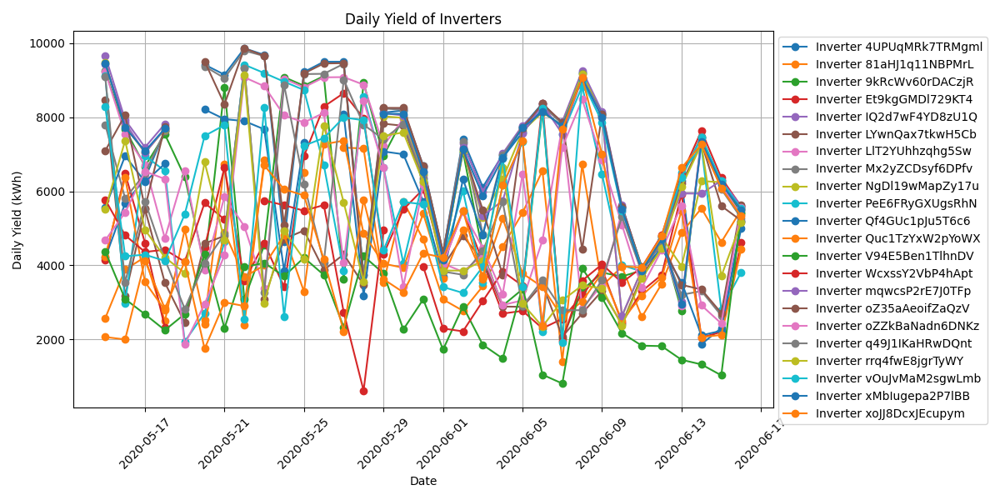
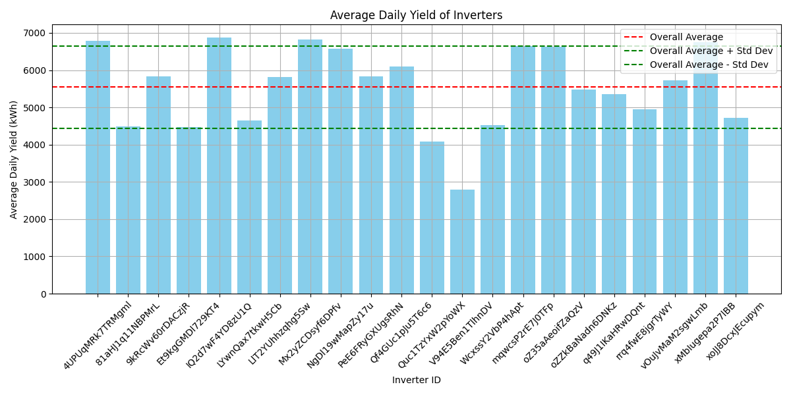
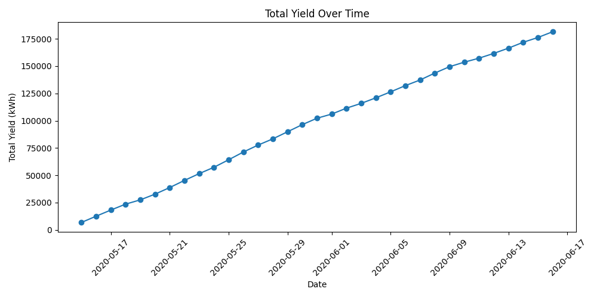
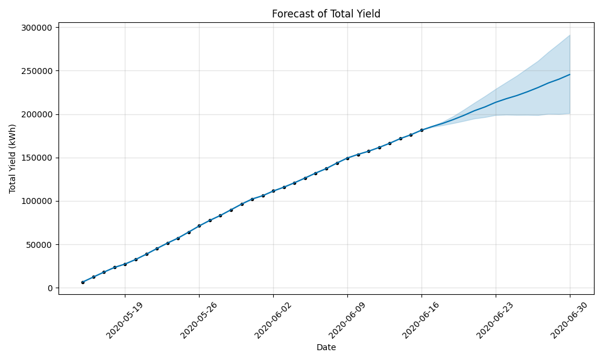

# Solar Panel Analysis
 

## Background and Overview
As part of our ongoing efforts to optimize renewable energy output, our team conducted an in-depth analysis of solar panel generation and weather sensor data collected from two solar farms in India. Over a 34-day period, data was recorded at 15-minute intervals to capture detailed operational metrics.

### Data Collection & Structure:

#### Power Generation Data:
 Data is collected at the inverter level, where each inverter monitors multiple strings of solar panels. This granular approach allows us to assess the performance of individual inverters and identify any discrepancies or areas for maintenance.  

#### Weather Sensor Data:
Weather measurements are captured at the plant level via a single, strategically placed array of sensors. This setup provides an overview of environmental conditions impacting the entire solar farm, ensuring that our energy generation forecasts account for real-time weather variations.

By integrating these datasets, we can develop robust models to predict future power output, identify efficiency trends, and ultimately enhance our operational strategies.

## Executive Summary

## Project Goals
Analysis aims to achieve the following objectives:
1. Forecast Future Power Generation
    - Develop accurate predictive models to forecast solar power generation for the next few days.
    - This will support improved grid management and energy distribution planning.
2. Optimize Maintence Scheduling:
    - Detect performance patterns that indicate when panels may require cleaning or routine maintenance, ensuring that overall effiency is maintained and downtime is minimized.
3. Identifying Faulty or Underperforming Panels:
    - Analyze the data to pinpoint panels that are malfunctioning or underperforming, enabling targeted interventions to enhance system reliablity and energy output.

## Data Structure Overview

## Insights Deep Dive
### 1. Forecast Future Power Generation
#### Plant 1
- the following graph shows the daily yield of all inverters located in plant 1. Many of the inverters were missing days from their data which would cause problems when forcasting data. To overcome this, we decided to use the average daily yield of all inverters to fill in the missing data. This was done by taking the average of all the inverters that were present on that day and using that as a replacement for the missing data. This method was chosen because it would allow us to use all of the data available to us and not just the data from one inverter.

- In determing whether using a average for the daily yield would have been the best approach we created a bar chart to see the variations of average daily yield for all inverters. The bar chart showed that their were about 4 inverters that were producing a lot less energy then the rest, so we decided to remove those inverters from the average. This was done to ensure that the average was not skewed by the outliers and that we were getting a more accurate representation of the daily yield.

- After the removal of the outliers the remaining inverters fit within the 1 standard deviation of the average daily yield. This was a good sign that the data was not skewed and that we were getting a more accurate representation of the daily yield.

- We then graphed the total yield of the average daily yield of all inverters over time. This was done to see if there were any trends in the data and to see if the average daily yield was increasing or decreasing over time. The graph showed that the average daily yield was increasing over time, which was a good sign that the panels were performing well and that the data was accurate.

- We then used the total yield of the average daily yield of all inverters over time to create a predictive model for the next 14 days. This was done using prohet, a forecasting tool that uses time series data to make predictions. The model was trained on the total yield of the average daily yield of all inverters over time and was able to predict the next 14 days with a high degree of accuracy.

- The model showed a difference between real and predicted value of about 0.00004%. 
- The forcasted power generation for the next 14 days is about 106,504 kWh. 

#### Plant 2
- When determineing the consistency of Daily Yield of Inverters within plant 2 we found that their was much more variation in the data. Believing that this would cause a problem with the data, the processed was uncontinued using the sum of the Total Yield to determine whether a more accurate model could be created.
- But first a bar graph was used to determine whether any of the data could be removed. Findings showed that their were many more outliers than in plant 1. This was a problem that would cause more more of the data to be skewed.

- Using the cummilation of all total yields from interperters this data was much more linear and did not have as many outliers. This would allow for a more accurate model to be created.

- The forcast however showed much more variation in the predictions. Further investiagtion into the outliers will be conducted to determine if they are faulty panels or if they are just not producing as much energy as the rest of the panels.

### 2. Optimize Maintenance Scheduling
#### Plant 1
To optimize maintenance scheduling, we analyzed the correlation between weather variables and power generation. Initially, the heatmap revealed a weak correlation between daily yield and all other variables, suggesting potential issues with data collection.

Upon further investigation, we identified an anomaly in week 24, where daily yield surged unexpectedly. To prevent this outlier from skewing our analysis, we removed week 24 and re-evaluated the correlation. The revised heatmap showed a stronger relationship between daily yield and weather variables, particularly module temperature and ambient temperature.

After removal, the correlation between daily yield and module temperature increased from 0.27 to 0.71, indicating a significant improvement in data reliability. Given this anomaly, a detailed investigation into Plant 1’s inverters is necessary to determine its cause.

Additionally, module temperature can serve as a key indicator for determining cleaning schedules. Since it should closely align with ambient temperature, deviations may suggest dust accumulation or other factors affecting efficiency. Implementing this insight could improve long-term performance and maintenance planning.

#### Plant 2
In Plant 2, the correlation between daily yield and weather variables was immediately stronger than in Plant 1. However, the strongest correlation was observed between daily yield was both DC power and AC power, with a correlation coefficient of 0.79. This suggests that the inverters are operating efficiently, with minimal energy loss during conversion.

Furthermore, DC and AC power can serve as key indicators for determining cleaning schedules. A significant drop in AC power relative to DC power may indicate dirty panels, as reduced efficiency in energy conversion often correlates with surface contamination. Monitoring these metrics can help optimize maintenance timing, ensuring sustained performance.

### 3. Indentifying Faulty or Underperforming Panels
 - Plant 1 consists of 22 inverters, with 3 underperforming relative to the standard deviation of the plant’s average daily yield. These inverters are generating approximately 3% less energy than expected, resulting in a daily yield reduction of 274.7 kWh. Over a month, this could lead to a total energy loss of ~8,241 kWh, significantly impacting overall plant efficiency and potential revenue.

- In contrast, Plant 2 is experiencing a significantly more drastic performance issue. Four underperforming solar panels are generating 23% less energy than expected, leading to a daily yield reduction of 3,202.95 kWh—over 11 times the loss observed in Plant 1. If left unresolved, this could result in a staggering ~96,088.5 kWh loss per month, posing a substantial threat to operational efficiency and profitability

- Plant 1 has a moderate efficiency loss (3%, 274.7 kWh/day), requiring monitoring and maintenance checks.
- Plant 2 has a severe efficiency loss (23%, 3,202.95 kWh/day), demanding urgent investigation and   corrective actions.

## Recommendations

## Technical Details

## Caveats and Assumptions

